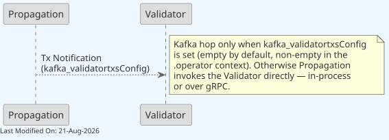

# Kafka in Teranode

## Table of Contents

1. [Description](#1-description)
2. [Use Cases](#2-use-cases)
    - [Propagation Service](#propagation-service)
    - [Validator Component](#validator-component)
    - [P2P Service](#p2p-service)
    - [Blockchain](#blockchain)
    - [Additional Kafka Topics](#additional-kafka-topics)
3. [Reliability and Recoverability](#3-reliability-and-recoverability)
    - [Consumer Resilience](#consumer-resilience)
4. [Configuration](#4-configuration)
    - [TLS and Authentication](#tls-and-authentication)
    - [Trust Model and Network Isolation](#trust-model-and-network-isolation)
5. [Operational Guidelines](#5-operational-guidelines)
    - [Performance Tuning](#performance-tuning)
    - [Reliability Considerations](#reliability-considerations)
    - [Monitoring](#monitoring)
6. [Kafka URL Configuration Parameters](#6-kafka-url-configuration-parameters)
    - [Consumer Configuration Parameters](#consumer-configuration-parameters)
    - [Producer Configuration Parameters](#producer-configuration-parameters)
    - [Advanced Consumer Parameters](#advanced-consumer-parameters)
7. [Service-Specific Kafka Settings](#7-service-specific-kafka-settings)
    - [Auto-Commit Behavior by Service Criticality](#auto-commit-behavior-by-service-criticality)
    - [Kafka Consumer Concurrency](#kafka-consumer-concurrency)
    - [Service-Specific Performance Settings](#service-specific-performance-settings)
    - [Configuration Examples by Service](#configuration-examples-by-service)
8. [Other Resources](#8-other-resources)

## 1. Description

Kafka is a high-throughput, distributed messaging system designed to store and process large volumes of data. Its key features include scalability, fault-tolerance, and high availability, making it an ideal choice for real-time data processing and analytics in complex systems like Teranode.

In the Teranode ecosystem, Kafka plays a crucial role in facilitating communication between various components, such as the Validator, BlockValidation, and Blockchain. It enables these components to exchange messages, notifications, and data reliably and efficiently, ensuring smooth operation of the entire system.

It's important to note that Kafka is a third-party dependency in Teranode. As such, there is no specific installation or configuration process provided within the Teranode framework. Users are expected to have a properly configured Kafka setup running before initiating the Teranode services. This approach allows for flexibility in Kafka configuration based on specific deployment needs and existing infrastructure.

**Development Mode**: Development and test contexts use in-memory Kafka by default (`KAFKA_SCHEMA.dev = memory`), requiring no external Kafka setup. For production-like testing with Docker Kafka, see [Kafka Settings Reference](../../references/settings/kafka_settings.md).

## 2. Use Cases

### Propagation Service

After initial sanity check tests, the propagation service endorses transactions to the validator. This is done by sending transaction notifications to the validator via the `kafka_validatortxsConfig` topic.



- **kafka_validatortxsConfig**: This Kafka topic is used to transmit new transaction notifications from the Propagation component to the Validator.

### Validator Component


This diagram illustrates the central role of the Validator in processing new transactions, and how it uses Kafka:

1. The Validator receives new transactions from the Propagation component via the `kafka_validatortxsConfig` topic.

2. Valid transactions are forwarded to the Block Assembly component using **direct gRPC calls** (not Kafka). The Validator uses the `blockAssembler.Store()` method for synchronous transaction processing required for mining candidate generation.

3. The Validator sends new UTXO (Unspent Transaction Output) metadata to the Subtree Validation component through the `kafka_txmetaConfig` topic for inclusion in new subtrees. Should a reversal be required, the same topic is  used to notify a deletion ("delete" command).

4. If a transaction is rejected, the Validator notifies the P2P component via the `kafka_rejectedTxConfig` topic, allowing the network (other peers) to be informed about invalid transactions.

### P2P Service


The P2P (Peer-to-Peer) service is responsible for peer-to-peer communication, receiving and sending data to other nodes in the network. Here's how it interacts with other components using Kafka:

1. It receives notifications about rejected transactions from the Validator through the `kafka_rejectedTxConfig` topic, allowing it to inform other nodes in the network.

2. The P2P component propagates new blocks (as received from other peers in the network) to the Block Validation component via the `kafka_blocksConfig` topic, initiating the block validation process.

3. New subtrees (as received from other peers in the network) are sent from the P2P component to the Subtree Validation component using the `kafka_subtreesConfig` topic, enabling efficient validation of large transaction sets.

### Blockchain


This diagram shows the final stage of block processing:

- The Blockchain component sends newly finalized blocks to the Blockpersister component using the `kafka_blocksFinalConfig` topic. This ensures that validated and accepted blocks are permanently stored in the blockchain.

### Additional Kafka Topics

Beyond the main processing topics described above, Teranode uses additional Kafka topics for error handling and legacy compatibility:

#### Invalid Block Notifications

- **kafka_invalid_blocks** (`KAFKA_INVALID_BLOCKS` in settings): Used to communicate invalid blocks detected during validation
    - **Purpose**: Allows services to be notified when a block fails validation
    - **Consumers**: Services that need to track or respond to invalid block events
    - **Auto-Commit**: Varies by consumer requirements

#### Invalid Subtree Notifications

- **kafka_invalid_subtrees** (`KAFKA_INVALID_SUBTREES` in settings): Used to communicate invalid subtrees detected during validation
    - **Purpose**: Allows services to be notified when a subtree fails validation
    - **Consumers**: Services that need to track or respond to invalid subtree events
    - **Auto-Commit**: Varies by consumer requirements

#### Legacy P2P Inventory

- **kafka_legacy_inv** (`KAFKA_LEGACY_INV` in settings): Used by the Legacy P2P service for backward compatibility
    - **Purpose**: Supports inventory message propagation for legacy Bitcoin protocol compatibility
    - **Consumers**: Legacy P2P service components
    - **Auto-Commit**: Typically enabled for compatibility layer

## 3. Reliability and Recoverability

Kafka's role as a critical component in the Teranode system cannot be overstated. Its central position in facilitating the communication of new transactions, remote subtrees, and blocks makes it indispensable for the node's operation.

To maintain system integrity, Teranode is designed to pause operations when Kafka is in an unreliable state. This means:

1. The system will not process new transactions, blocks, or subtrees until Kafka is available and functioning correctly.
2. During Kafka downtime or unreliability, the node enters a safe state, preventing potential data inconsistencies or processing errors.
3. Once Kafka is reported as healthy again, the node automatically resumes normal operation without manual intervention.

### Consumer Resilience

The franz-go Kafka client handles broker disconnections, metadata refresh, and reconnection internally. Key timeout settings that control this behavior:

- **`FetchMaxWait`** (configured via `maxProcessingTime`, default 100ms): Broker responds within this time even with no data, preventing indefinite blocking.
- **`SessionTimeout`** (default 10s): Broker detects dead consumers automatically.
- **`HeartbeatInterval`** (default 3s): Consumer sends periodic heartbeats to the broker.
- **`RebalanceTimeout`** (default 60s): Maximum time for consumer group rebalancing.

#### Offset Out of Range Handling

Teranode handles offset out of range errors automatically:

- **Cause**: Committed offset has been deleted due to retention policies
- **Detection**: franz-go detects offset out of range internally
- **Recovery**: The `offsetReset` configuration resets to the configured offset (typically "latest")
- **No Data Loss**: For critical topics, longer retention periods prevent offset expiration

## 4. Configuration

For comprehensive configuration documentation including all settings, defaults, and interactions, see the [Kafka Settings Reference](../../references/settings/kafka_settings.md).

### TLS and Authentication

Teranode supports secure Kafka connections using TLS/SSL encryption and authentication. TLS configuration is applied globally to all Kafka connections.

#### Global TLS Settings

Configure TLS in `settings.conf`:

```properties
KAFKA_ENABLE_TLS = true
KAFKA_TLS_SKIP_VERIFY = false  # Set to true only for testing/development
```

#### Certificate Configuration

For production deployments with TLS enabled, configure certificate paths:

```properties
# Path to CA certificate for verifying broker certificates
KAFKA_TLS_CA_FILE = /path/to/ca-cert.pem

# Path to client certificate for mutual TLS authentication
KAFKA_TLS_CERT_FILE = /path/to/client-cert.pem

# Path to client private key
KAFKA_TLS_KEY_FILE = /path/to/client-key.pem
```

**Important**: All three certificate files must be provided when using mutual TLS authentication. For server-side TLS only (broker certificate verification), only `KAFKA_TLS_CA_FILE` is required.

#### Debug Logging

Enable verbose Kafka client library logging for troubleshooting connection issues:

```properties
kafka_enable_debug_logging = true
```

**Warning**: Debug logging is extremely verbose and should only be enabled for troubleshooting. Not recommended for production environments.

#### Configuration Example

Production TLS configuration:

```properties
# Enable TLS
KAFKA_ENABLE_TLS = true
KAFKA_TLS_SKIP_VERIFY = false

# Certificate paths
KAFKA_TLS_CA_FILE = /etc/teranode/certs/kafka-ca.pem
KAFKA_TLS_CERT_FILE = /etc/teranode/certs/client-cert.pem
KAFKA_TLS_KEY_FILE = /etc/teranode/certs/client-key.pem

# Kafka broker URLs. 9093 here is a conventional external TLS listener, not the
# deployment shipped in this repository — there, 9093 is pandaproxy and the broker
# listens PLAINTEXT-only on 9092. See "Trust Model and Network Isolation" below.
KAFKA_HOSTS = kafka1.example.com:9093,kafka2.example.com:9093
```

Development/testing configuration (skip certificate verification):

```properties
KAFKA_ENABLE_TLS = true
KAFKA_TLS_SKIP_VERIFY = true  # Only for testing!
kafka_enable_debug_logging = true  # For troubleshooting
```

### Trust Model and Network Isolation

The manifests and compose files shipped in this repository (`deploy/kubernetes/kafka/`,
`deploy/docker/base/`) run Kafka/Redpanda with **no broker ACLs, no SASL, and a plaintext
listener by default**. `KAFKA_ENABLE_TLS` is `false` out of the box, so client-side mTLS
(described above) is available but not active until an operator turns it on. Nothing in the
default deployment restricts *who* can connect to the broker or *which* topics a connected
client may write to.

This means the security boundary for Kafka, as shipped, is **network isolation, not
authentication**: any workload with network reach to the Kafka Service can publish or
consume on any topic, including forging messages onto topics other services trust.

- `deploy/kubernetes/kafka/kafka-shared-networkpolicy.yaml` restricts ingress to the Kafka
  pods to same-namespace traffic only, as a default-deny boundary against workloads outside
  the namespace **on clusters whose CNI plugin enforces NetworkPolicy**. This is a real
  prerequisite, and it fails open silently: any apiserver accepts and stores the object
  regardless, `kubectl get networkpolicy` shows it as present either way, and a cluster whose
  CNI does not implement NetworkPolicy simply ignores it with no error. Verify enforcement
  before relying on it — the manifest carries a probe command in its header comment. The
  policy is also intentionally a coarse, same-namespace allowlist rather than a per-service
  one: there is no consistent pod-label scheme shared across every producer/consumer service
  and deployment style (docker-compose-derived manifests vs. the operator-managed CRs in
  `deploy/kubernetes/teranode/`) to key a tighter selector off. Treat it as a floor, not a
  substitute for proper multi-tenant segmentation.
- For non-Kubernetes deployments, `deploy/docker/base/docker-services.yml` already publishes
  the broker (`9092`), pandaproxy (`9093`) and schema registry (host `9096` → container
  `8081`) bound to `127.0.0.1`, so they are not reachable off-host by default. Two residual
  gaps: any container on the `teranode-network` bridge still reaches the broker directly on
  `kafka-shared:9092`, and the stacks under `compose/` do not all have that loopback binding
  (`docker-compose-ss.yml` publishes `9092`/`9093` on all interfaces). On bare metal, restrict
  those ports with a firewall rule.
- Not every topic carries the same trust weight if that boundary is breached. The
  characterisation below covers every topic wired into the Go code, and holds only under the
  default settings shipped in `settings.conf`.
    - `blocks`, `subtrees`, `invalid-blocks`, `invalid-subtrees`, `rejectedtx`,
      `tx-policy-rejected` and `legacy-inv` carry pointers or advisory data that downstream
      services re-validate or treat as unblessed input, so forged messages cannot inject data.
      Two qualifications: the `URL` field on `blocks` and `subtrees` is attacker-chosen and
      only scheme-checked (`http`/`https`, plus the literal `legacy`) with no restriction on
      the host, so produce access gives an outbound-fetch primitive from the validating pods,
      aimed at any host and driven at any rate the producer chooses; and `legacy-inv` messages
      are dropped unless they name a currently connected peer, in which case they drive
      getdata requests for attacker-chosen hashes to that peer.
    - `txmeta` message contents are written directly into the in-memory tx-metadata cache, and
      a cache hit makes subtree validation treat the transaction as already known — it is
      never fetched or validated at all. The cached `fee`, `sizeInBytes` and parent inpoints
      are then written into the subtree and subtree-meta files this node stores and serves,
      where they feed the block fee/reward check and the order-and-blessed check. Proof-of-work
      and the authoritative UTXO store still bound what can ultimately get confirmed —
      forged `txmeta` entries cannot forge transactions or double-spend — but the reachable
      surface is wider than a single skipped signature check.
    - `validatortxs` (empty by default, populated in the `.operator` context, i.e. exactly the
      Kubernetes deployment this NetworkPolicy targets) carries the raw transaction *and* the
      validation options applied to it — `skipPolicyChecks`, `skipUtxoCreation`,
      `addTXToBlockAssembly`, `createConflicting`. The Validator takes all four from the
      message as-is, with no check that the producer was entitled to request them, so produce
      access to this topic means choosing the validation mode a transaction is processed
      under (`skipPolicyChecks` maps to consensus-mode validation, bypassing local policy).
      The `options` field itself is optional-presence on the wire; a message that omits it
      falls back to the validator's own defaults (`services/validator/Server.go`,
      `optionsFromKafkaMessage`) — the same defaults the in-tree Propagation producer already
      sends — rather than crashing or silently becoming more permissive. More generally, the
      Kafka consumer now recovers a panic in any topic's handler instead of letting it take
      down the process (`util/kafka/kafka_consumer.go`), so a malformed message on this or any
      other topic is a logged, counted event, not an outage.
    - `blocks-final` is the one topic whose contents leave the node. The legacy sync manager
      relays each message's hash and 80-byte header to every connected legacy P2P peer without
      checking proof-of-work, without consulting the blockchain store, and without verifying
      that the header hashes to the hash in the message key. The bound on this is real:
      forged messages cannot get an invalid block accepted anywhere, because receiving peers
      still check proof-of-work and chain connectivity, and this node cannot serve a block it
      does not have. What they do is turn this node into a source of junk block announcements,
      at whatever rate the producer chooses — grounds for peer misbehaviour scoring or a ban.
  Treat write access to `txmeta`, `validatortxs` and `blocks-final` as the topics that carry
  real weight.

**Operators running Kafka in a shared or multi-tenant cluster, or subject to compliance
requirements, should not rely on network isolation alone.** On top of the NetworkPolicy:

- Enable `KAFKA_ENABLE_TLS` (and provide `KAFKA_TLS_CA_FILE`/`KAFKA_TLS_CERT_FILE`/
  `KAFKA_TLS_KEY_FILE` for mutual TLS) as documented above — the client side is wired into
  every producer and consumer path already, it is simply off by default. **The client flag on
  its own is not enough.** The Redpanda instance shipped here starts with
  `--kafka-addr PLAINTEXT://0.0.0.0:9092` and nothing else
  (`deploy/kubernetes/kafka/kafka-shared-deployment.yaml`, `deploy/docker/base/docker-services.yml`),
  so turning client TLS on against it breaks connectivity rather than securing anything.
  Enabling mTLS also requires configuring a broker TLS listener with broker certificates, and
  adding that listener's port to `kafka-shared-networkpolicy.yaml` — the policy hard-codes
  `9092`/`9093`/`8081`, so a TLS listener on a fourth port is silently blocked by it.
- Configure broker-side ACLs restricting write access to the weighty topics to the identity
  of their legitimate producer — `txmeta` and `validatortxs` to the Validator and Propagation
  services respectively, `blocks-final` to the Blockchain service — and, more generally,
  restricting produce/consume per topic to the services that need it. Teranode does not implement or configure broker ACLs itself —
  this is a Kafka/Redpanda broker-side configuration and certificate-distribution decision
  that has to be made per deployment, and is out of scope for the client library to enforce.
- There is currently no SASL/SCRAM support in the Kafka client (`util/kafka/`). Where broker
  ACLs require SASL rather than mTLS-based identity, that is a gap requiring further client
  work, not something enabled by an existing setting.

## 5. Operational Guidelines

### Performance Tuning

1. **Partition Optimization**
    - Each partition can only be consumed by one consumer in a consumer group
    - Increase partitions to increase parallelism, but avoid over-partitioning
    - General guideline: Start with partitions = number of consumers * 2

2. **Resource Allocation**
    - Kafka is memory-intensive; ensure sufficient RAM
    - Disk I/O is critical; use fast storage (SSDs recommended)
    - Network bandwidth should be sufficient for peak message volumes

3. **Producer Tuning**
    - Batch messages when possible by adjusting `flush_*` parameters
    - Monitor producer queue size and adjust if messages are being dropped

### Reliability Considerations

1. **Replication Factor**
    - Minimum recommended for production: 3
    - Ensures data survives broker failures

2. **Consumer Group Design**
    - Critical services should use dedicated consumer groups
    - Monitor consumer lag to detect processing issues

3. **Error Handling**
    - Services have different retry policies based on criticality
    - Block and subtree validation use manual commits to ensure exactly-once processing

### Monitoring

Key metrics to monitor:

1. **Broker Metrics**
    - CPU, memory, disk usage
    - Network throughput

2. **Topic Metrics**
    - Message rate
    - Byte throughput
    - Partition count

3. **Consumer Metrics**
    - Consumer lag
    - Processing time
    - Error rate

4. **Producer Metrics**
    - Send success rate
    - Retry rate
    - Queue size

## 6. Kafka URL Configuration Parameters

**Note**: For a comprehensive reference of all Kafka configuration parameters including advanced settings, see [Kafka Settings Reference](../../references/settings/kafka_settings.md). This section provides a quick overview of the most common parameters.

### Consumer Configuration Parameters

When configuring Kafka consumers via URL, the following query parameters are supported:

| Parameter | Type | Default | Description |
|-----------|------|---------|-------------|
| `partitions` | int | 1 | Number of topic partitions to consume from |
| `consumer_ratio` | int | 1 | Ratio for scaling consumer count (partitions/consumer_ratio) |
| `replay` | int | 1 | Whether to replay messages from beginning (1=true, 0=false) |
| `group_id` | string | - | Consumer group identifier for coordination |

**Example Consumer URL:**

```text
kafka://localhost:9092/transactions?partitions=4&consumer_ratio=2&replay=0&group_id=validator-group
```

### Producer Configuration Parameters

When configuring Kafka producers via URL, the following query parameters are supported:

| Parameter | Type | Default | Description |
|-----------|------|---------|-------------|
| `partitions` | int | 1 | Number of topic partitions to create |
| `replication` | int | 1 | Replication factor for topic |
| `retention` | string | "600000" | Message retention period (ms) |
| `segment_bytes` | string | "1073741824" | Segment size in bytes (1GB) |
| `flush_bytes` | int | varies | Flush threshold in bytes (1MB async, 1KB sync) |
| `flush_messages` | int | 50000 | Number of messages before flush |
| `flush_frequency` | string | "10s" | Time-based flush frequency |

**Example Producer URL:**

```text
kafka://localhost:9092/blocks?partitions=2&replication=3&retention=3600000&flush_frequency=5s
```

### Advanced Consumer Parameters

Advanced URL parameters for fine-tuning consumer behavior and timeout configuration:

| Parameter | Type | Default | Description |
|-----------|------|---------|-------------|
| `maxProcessingTime` | int (ms) | 100 | Max time broker waits before returning fetch results when no records are available (franz-go FetchMaxWait) |
| `sessionTimeout` | int (ms) | 10000 | Time broker waits for heartbeat before declaring consumer dead |
| `heartbeatInterval` | int (ms) | 3000 | Frequency of heartbeats sent to broker |
| `rebalanceTimeout` | int (ms) | 60000 | Max time for all consumers to join rebalance |
| `offsetReset` | string | - | Offset reset strategy: "latest", "earliest", or "" (uses replay) |

**Important Constraints**:

- `sessionTimeout` must be >= 3 × `heartbeatInterval` (validated at consumer creation for both URL-based and direct configuration)
- For slow processing services (e.g., subtree validation), increase `sessionTimeout` and `heartbeatInterval` to prevent the broker from declaring the consumer dead during long processing

#### Timeout Configuration for Slow Processing Services

Services that process messages slowly (e.g., subtree validation with large datasets) need increased timeouts to prevent partition abandonment:

```text
kafka://localhost:9092/subtrees?partitions=4&consumer_ratio=1&sessionTimeout=90000&heartbeatInterval=20000
```

This configuration:

- Gives 90 seconds before broker declares consumer dead (3x heartbeat interval)
- Sends heartbeats every 20 seconds, allowing up to ~60 seconds of processing between heartbeats

#### Offset Reset Configuration

Control how consumers handle offset out of range errors:

```text
# Skip to latest on offset error (recommended for non-critical data)
kafka://localhost:9092/txmeta?offsetReset=latest

# Reprocess from earliest on offset error (for critical data recovery)
kafka://localhost:9092/blocks?offsetReset=earliest
```

**Offset Reset Strategies**:

- `latest`: Skip to newest message (data loss acceptable)
- `earliest`: Reprocess from oldest available message (no data loss if within retention)
- `""` (empty): Use `replay` parameter setting (legacy behavior)

## 7. Service-Specific Kafka Settings

### Auto-Commit Behavior by Service Criticality

Auto-commit in Kafka is a consumer configuration that determines when and how message offsets are committed (marked as processed) back to Kafka. When auto-commit is enabled, Kafka automatically commits message offsets at regular intervals (default is every 5 seconds). When auto-commit is disabled, it is the responsibility of the application to manually commit offsets after successfully processing messages.

Kafka consumer auto-commit behavior varies by service based on processing criticality:

#### Auto-Commit Enabled Services

These services can tolerate potential message loss for performance:

- **TxMeta Cache (Subtree Validation)**: `autoCommit=true`
    - Rationale: Metadata can be regenerated if lost
    - Performance priority over strict delivery guarantees

- **Rejected Transactions (P2P)**: `autoCommit=true`
    - Rationale: Rejection notifications are not critical for consistency
    - Network efficiency prioritized

#### Auto-Commit Disabled Services

These services require exactly-once processing guarantees:

- **Subtree Validation**: `autoCommit=false`
    - Rationale: Transaction processing must be atomic
    - Manual commit after successful processing

- **Block Persister**: `autoCommit=false`
    - Rationale: Block finalization is critical for blockchain integrity
    - Manual commit ensures durability

- **Block Validation**: `autoCommit=false`
    - Rationale: Block processing affects consensus
    - Manual commit prevents duplicate processing

### Kafka Consumer Concurrency

**Important**: Unlike what the service-specific `kafkaWorkers` settings might suggest, Kafka consumer concurrency in Teranode is actually controlled through the `consumer_ratio` URL parameter for each topic. The actual number of consumers is calculated as:

```text
consumerCount = partitions / consumer_ratio
```

Common consumer ratios in use:

- `consumer_ratio=1`: One consumer per partition (maximum parallelism)
- `consumer_ratio=4`: One consumer per 4 partitions (balanced approach)

### Service-Specific Performance Settings

#### Propagation Service Settings

- **`validator_kafka_maxMessageBytes`**: Size threshold for routing decisions
    - **Purpose**: Determines when to use HTTP fallback vs Kafka
    - **Default**: 1048576 (1MB)
    - **Usage**: Large transactions routed via HTTP to avoid Kafka message size limits

#### Validator Service Settings

- **`validator_kafkaWorkers`**: Number of concurrent Kafka processing workers
    - **Purpose**: Controls parallel transaction processing capacity
    - **Tuning**: Should match CPU cores and expected transaction volume
    - **Integration**: Works with Block Assembly via direct gRPC (not Kafka)

### Configuration Examples by Service

#### High-Throughput Service (Propagation)

```text
kafka_validatortxsConfig=kafka://localhost:9092/validator-txs?partitions=8&consumer_ratio=2&flush_frequency=1s
validator_kafka_maxMessageBytes=1048576  # 1MB threshold
```

#### Critical Processing Service (Block Validation)

```text
kafka_blocksConfig=kafka://localhost:9092/blocks?partitions=4&consumer_ratio=1&replay=0
blockvalidation_kafkaWorkers=4
autoCommit=false  # Manual commit for reliability
```

#### Metadata Service (Subtree Validation)

```text
kafka_txmetaConfig=kafka://localhost:9092/txmeta?partitions=2&consumer_ratio=1&replay=1
autoCommit=true   # Performance over strict guarantees
```

## 8. Other Resources

- [Kafka Message Format](../../references/kafkaMessageFormat.md)
- [Block Data Model](../datamodel/block_data_model.md): Contain lists of subtree identifiers.
- [Subtree Data Model](../datamodel/subtree_data_model.md): Contain lists of transaction IDs and their Merkle root.
- [Extended Transaction Data Model](../datamodel/transaction_data_model.md): Includes additional metadata to facilitate processing.
